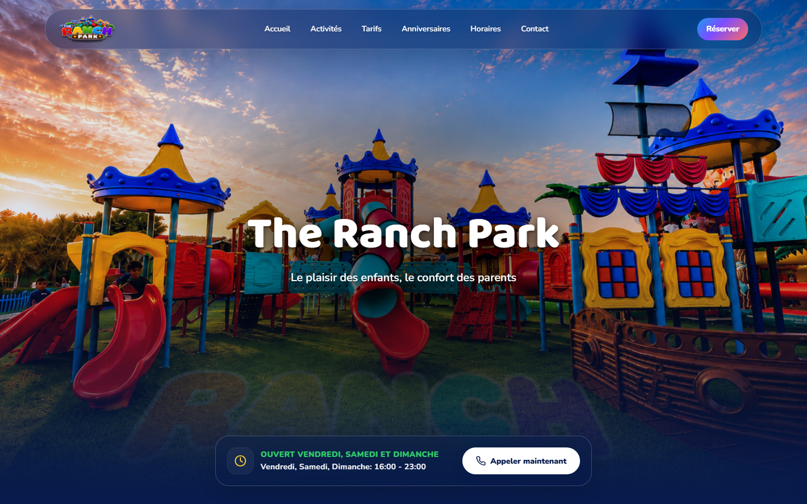
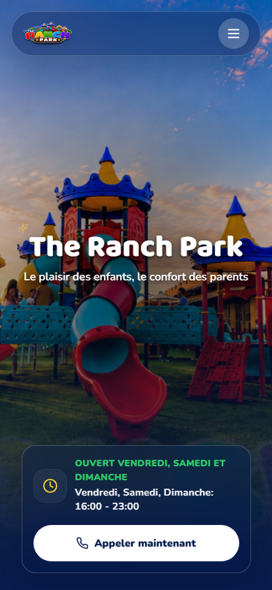
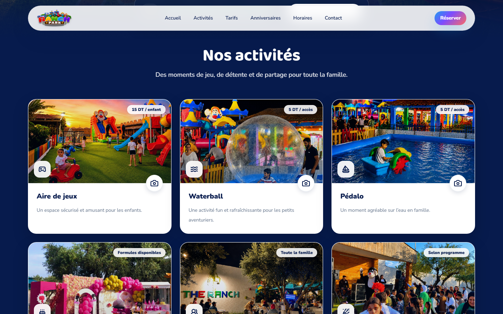

# The Ranch Park

[](LICENSE)

**A responsive website for a family recreation park in Ezzahra, Tunisia.**

[Live website](https://theranchpark.tn) · [View source](https://github.com/faresxjmaii/theranchpark)

## Preview

[](https://theranchpark.tn)

## Screenshots

| Mobile home | Activities and pricing |
| --- | --- |
|  |  |

## What It Does

The Ranch Park website gives families one clear place to check activities, prices, opening hours, birthday options, visitor reviews, and directions before visiting.

The interface is designed around the questions a parent is likely to ask first. Calls, WhatsApp reservations, and Google Maps directions remain easy to reach across screen sizes.

## Main Features

- Responsive landing page built for desktop and mobile
- Activity cards with real photos and gallery views
- Video carousel with optional sound
- Pricing, opening hours, and birthday package sections
- Google and Facebook review presentation
- Embedded map, social links, phone calls, and WhatsApp actions
- Reduced-motion support and keyboard-accessible controls

## Tech Stack

- React 19 and TypeScript
- Vite
- Tailwind CSS
- Framer Motion
- Embla Carousel
- Lucide React
- Vercel

## Project Structure

```text
.
├── public/                 # Static images, gallery photos, and videos
├── screenshots/            # Real project screenshots used in this README
├── src/
│   ├── assets/             # Imported activity images
│   ├── components/         # Page sections and reusable UI
│   ├── data/               # Centralized site content
│   ├── hooks/              # Shared React hooks
│   ├── App.tsx             # Page composition
│   └── main.tsx            # Application entry point
└── package.json
```

## Installation

Requirements: Node.js 20 or newer and npm.

```bash
git clone https://github.com/faresxjmaii/theranchpark.git
cd theranchpark
npm install
```

This project does not require environment variables.

## Run Locally

```bash
npm run dev
```

Vite will print the local development URL in the terminal.

## Build

```bash
npm run typecheck
npm run build
npm run preview
```

The production build is written to `dist/`.

## Deployment

The site is deployed on Vercel. A standard Vite deployment works with:

- Build command: `npm run build`
- Output directory: `dist`

## Roadmap

- Connect opening hours and announcements to a small content management workflow
- Add dedicated gallery collections for each activity
- Improve media loading for slower mobile connections
- Add structured data for local search

## Author

Designed and developed by [Fares Jmai](https://github.com/faresxjmaii).

The project includes the responsive UI, component structure, animations, galleries, media sections, contact flows, and deployment setup.

## Contact

- GitHub: [@faresxjmaii](https://github.com/faresxjmaii)
- Live project: [theranchpark.tn](https://theranchpark.tn)

## License

This project is licensed under the MIT License. See the [LICENSE](LICENSE) file for details.

Source code is licensed under the MIT License. Brand assets, images, videos, and logos belong to their respective owners and are not included in the license.
